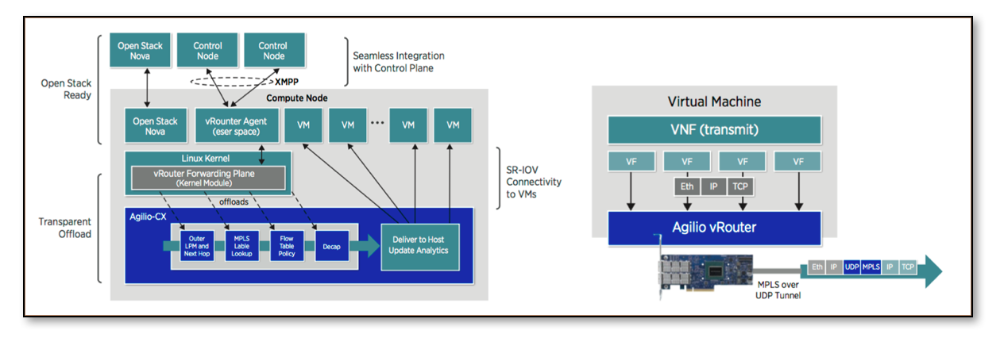

# Netronome vRouter Installation Guide (Fresh Install)

## Pre-Requisites

* Ubuntu 14.04.4 (3.13.0-100 Errata 47 patched kernel)
* Contrail-Cloud 3.1.2.0-65 (OpenStack Kilo/Mitaka)
* Agilio vRouter 3.1.0.0-124

## Remove existing Contrail & Fabric installations
      dpkg -l | awk '/contrail/ {print $2}' | xargs -Iz dpkg -r z

## On all nodes
* Install Ubuntu 14.04.4 on all the nodes in the setup
         
## On Controller node

* Download & install Contrail packages

      dpkg -i contrail-install-packages_3.1.*.*_all.deb
      cd /opt/contrail/contrail_packages && ./setup.sh
      apt-get update

* Populate testbed with relevant information

         (controller-node)# cat /opt/contrail/utils/fabfile/testbeds/testbed.py
         
                  bond= {
                      compute1 : { 'name': 'bond0', 'member': ['nfp_p0','nfp_p1','nfp_p2','nfp_p3'], 'mode': '802.3ad',    
                                'xmit_hash_policy': 'layer3+4' },
                      compute2 : { 'name': 'bond0', 'member': ['nfp_p0','nfp_p1','nfp_p2','nfp_p3'], 'mode': '802.3ad',    
                                'xmit_hash_policy': 'layer3+4' },
                  }
                  
                  control_data = {
                      controller : { 'ip': '172.31.255.1/24', 'gw' : '172.31.255.1', 'device': 'eth1' },
                      compute1 : { 'ip': '172.31.255.2/24', 'gw' : '172.31.255.1', 'device': 'bond0' },
                      compute2 : { 'ip': '172.31.255.3/24', 'gw' : '172.31.255.1', 'device': 'bond0' },
                  }
         
                  env.ns_agilio_vrouter = {
                      compute1: {'huge_page_alloc': '24G', 'huge_page_size': '1G', 'coremask': '2,4', 'pinning_mode': 
                                  'auto:split'},
                      compute2: {'huge_page_alloc': '24G', 'huge_page_size': '1G', 'coremask': '2,4', 'pinning_mode': 
                                  'auto:split'}
                  }

  [Click for example files](https://github.com/netronome-support/vRouter/tree/master/testbed)

* Install contrail-install-packages on remaining nodes

      cd /opt/contrail/utils
      fab install_pkg_all:/tmp/contrail-install-packages-x.x.x.x-xxx~openstack_version_all.deb
         
* Confirm installation of Contrail packages

      dpkg -l | grep contrail

* Upgrade all nodes to recommended kernel

      fab upgrade_kernel_all

* Confirm that correct kernel is running

      #uname -r
      3.13.0-106-generic

* Install ns-agilio-vrouter-depends-packages

      fab install_ns_agilio_nic:/tmp/ns-agilio-vrouter-depends-packages_x.x.x.x-xxx_amd64.deb

* Confirm installation of vRouter packages

      dpkg -l | grep vrouter

* Install Contrail dependencies

      cd /opt/contrail/contrail_install_repo
      dpkg -i libnl-3-200_3.2.21-1ubuntu4_amd64.deb
      apt-get -f install

      wget http://launchpadlibrarian.net/264517293/libexpat1_2.1.0-4ubuntu1.3_amd64.deb
      dpkg -i libexpat1_2.1.0-4ubuntu1.3_amd64.deb

* Install Contrail packages

      fab install_contrail

NOTE: If the above command fails when attempting to install default-jre-headless, execute the script below and rerun: *fab install_contrail*.

**#JRE_install**

      #!/bin/bash
      cp /etc/apt/sources.list /etc/apt/sources.list.back
      
      apt-get update
      DEBIAN_FRONTEND=noninteractive apt-get -y --force-yes --allow-unauthenticated install default-jre-headless
      sed -i '1s/^.//' /etc/apt/sources.list
      apt-get update

* Change the media configuration of the SmartNIC if you are using breakout cables (4 x 10GbE ---> 1 X 40GbE)
         
         This should create four NFP interfaces: nfp_p0, nfp_p1, nfp_p2, nfp_p3

      modprobe nfp #load nfp.ko driver
      /opt/netronome/bin/nfp-media --set-media=phy0=4x10G
      service ns-core-nic.autorun clean
      reboot

* Setup control_data interfaces

      fab setup_interface

NOTE: After this step you should have communication on the underlay network

* Provision the cluster

      fab setup_all

## On all nodes 

* Verify if provisioning was successfully

      contrail-status
      /opt/netronome/libexec/nfp-vrouter-status -r

# Netronome SmartNic Install Guide (Existing Setup)

NOTE: This guide assumes that you have already inserted the Netronome NIC on the server. For a list of supported servers, refer this [document](https://github.com/savithruml/netronome-agilio-vrouter/blob/3.1.2/list-of-supported-servers.pdf)

## On the new Netronome compute node

* Install the required Linux Kernel

        (compute-node)# apt-get install linux-image-3.13.0-100-generic 
        (compute-node)# apt-get install linux-headers-3.13.0-100-generic 
        (compute-node)# apt-get install linux-image-extra-3.13.0-100-generic 
        (compute-node)# apt-get install linux-image-generic 
        (compute-node)# apt-get install linux-generic

  In /etc/default/grub, ensure
  
        GRUB_DEFAULT='1>Ubuntu, with Linux 3.13.0-100-generic'
        GRUB_CMDLINE_LINUX_DEFAULT="intel_iommu=on iommu=pt intremap=on"

        (compute-node)# update-grub
        (compute-node)# reboot
        
* Install NFP dependencies

        (compute-node)# apt-get install dkms libftdi1 libjansson4

* Download Netronome (Agilio vRouter) package

        (compute-node)# tar -xvf ns-agilio-vrouter-release_3.1.0.0-124.tgz 
        (compute-node)# cd ns-agilio-vrouter-release_3.1.0.0-124/

* Install NFP packages
        
        (compute-node)# dpkg -i nfp-bsp-6000-b0*
        (compute-node)# ldconfig
        
* Flash the SmartNIC

        (compute-node)# /opt/netronome/bin/nfp-flash -P --i-accept-the-risk-of-overwriting-miniloader -w /opt/netronome/flash/flash-nic.bin 
        (compute-node)# /opt/netronome/bin/nfp-one
        (compute-node)# reboot
        
* Install Core NIC packages

        (compute-node)# cd ns-agilio-vrouter-release_3.1.0.0-124/
        (compute-node)# dpkg -i ns-agilio-core-nic*.deb
       
* Change the media configuration of the SmartNIC if you are using breakout cables (4 x 10GbE ---> 1 X 40GbE)
         
         This should create four NFP interfaces: nfp_p0, nfp_p1, nfp_p2, nfp_p3

         (compute-node)# /opt/netronome/bin/nfp-media --set-media=phy0=4x10G
         (compute-node)# service ns-core-nic.autorun clean
         (compute-node)# reboot

* Populate testbed with the new compute's information

         (controller-node)# vim /opt/contrail/utils/fabfile/testbeds/testbed.py
         
                  bond= {
                      compute3 : { 'name': 'bond0', 'member': ['nfp_p0','nfp_p1','nfp_p2','nfp_p3'], 'mode': '802.3ad',    
                                'xmit_hash_policy': 'layer3+4' }
                  }
                  
                  control_data = {
                      controller : { 'ip': '172.31.255.1/24', 'gw' : '172.31.255.1', 'device': 'eth1' },
                      compute3 : { 'ip': '172.31.255.4/24', 'gw' : '172.31.255.1', 'device': 'bond0' }
                  }
         
                  env.ns_agilio_vrouter = {
                      compute3: {'huge_page_alloc': '24G', 'huge_page_size': '1G', 'coremask': '2,4', 'pinning_mode': 
                                  'auto:split'},
                  }

   [Click for example files](https://github.com/savithruml/netronome-agilio-vrouter/blob/3.1.2/testbed)
  
 * Install Contrail
 
          (controller-node)# cd /opt/contrail/utils
          (controller-node)# fab install_pkg_node:/tmp/contrail-install-packages*.deb,root@<new-compute-ip>
          (controller-node)# ssh root@<new-compute-ip> "cd /opt/contrail/contrail_packages; ./setup.sh"
          
          (controller-node)# scp /tmp/ns-agilio-vrouter-depends-packages*.deb root@:<new-compute-ip>:/opt/contrail/contrail_install_repo/
          (controller-node)# fab install_pkg_node:/tmp/ns-agilio-vrouter-depends-packages*.deb,root@<new-compute-ip>
          (controller-node)# ssh root@<new-compute-ip> "cd /opt/contrail/contrail_packages_ns_agilio_vrouter; ./setup.sh"
          (controller-node)# ssh root@<new-compute-ip> "cd /opt/contrail/contrail_install_repo; dpkg-scanpackages . /dev/null | gzip -9c > Packages.gz; apt-get update"
          
          (controller-node)# fab add_vrouter_node:root@<new-compute-ip>

## Contrail-Netronome Architecture
  

